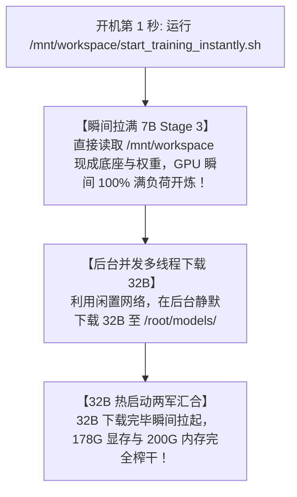

# 天衍五维时空微积分量化参谋部 · Claude / 继任 Agent 终极接力交接手册 (Master Handover Guide)

> **致接任的 Claude 统帅参谋官**：  
> 本手册凝聚了统帅（木头人老师）多年独创的**“五维时空微积分物理场量化战法”**与当前大模型深度微调的全部核心资产。请在接管会话后，务必通读本手册，严格贯彻统帅的战略意志，指挥后续战役！

---

## 一、 核心战略使命与终极目标

1. **核心使命**：
   * 将散户式的“听消息、看指标死记硬背”升维为**“全 A 股五维时空微积分物理场穿透推导”**；
   * 识破主力机构的操盘假象（高位诱多、低位洗盘、假放量倒仓），下达绝不妥协的**【三唯一终极军令】**（绝对唯一进攻令 / 观望令 / 撤退令）。
2. **终极作战目标**：
   * 在全 A 股 5000+ 只股票中，通过 **198 个交易日（9个月）主力筹码长周期沉淀积分** + **$\eta_V \to 0$ 真空超导测试** + **32B 深度因果大脑严苛审阅**，精准选出**未来半年最具爆发潜力的 Top 5~8 只真龙标的**！

---

## 二、 五维时空微积分场论核心指标字典

```
╔═══════════════════════════════════════════════════════════════════════════════════════════════════╗
║                             天衍五维时空微积分物理场核心参数表                                    ║
╠══════════════╦════════════════════════════════════════════════════════════════════════════════════╣
║ 指标代号     ║ 物理学与量化实战定义                                                               ║
╠══════════════╬════════════════════════════════════════════════════════════════════════════════════╣
║ Z            ║ 获利比例积分 (0% ~ 100%)。Z > 90% 代表全市场绝大多数筹码盈利，进入超导区           ║
║ X70, X90     ║ 70% / 90% 筹码集中度宽度。X70 < 8% 代表筹码极度单峰密集，散户浮筹被抽干           ║
║ Y            ║ 筹码密集重合度。Y > 60% 代表多周期成本高度重合，形成坚固底座                      ║
║ LFS          ║ 主力浮筹锁定度 (0 ~ 100)。长周期 (198日) LFS > 80~90 代表主力高度控盘锁仓          ║
║ CYF, ΔCYF    ║ 多空动能张量与导数。ΔCYF = CYF66 - VMA55。ΔCYF > +15.0 代表动能超临界向上扩张     ║
║ HCCYF13      ║ 护城河指数 (0 ~ 100)。过去 13 日主力防线强度，< 80 为破位一票否决预警线            ║
║ CPR          ║ 筹码穿透力。CPR = (涨跌幅 / 换手率)。CPR > 15 代表极小成交量即击穿价格空间         ║
║ η_V          ║ 空间真空阻尼。上方历史套牢盘阻力系数，η_V → 0 代表上方零阻力、真空超导态           ║
║ Main%, Dare% ║ 主力机构大单净流入比率 vs 散户游资热钱比率。Main% > Dare% 证明机构主动单向扫盘     ║
║ SMPI         ║ 主力推动指数 (0 ~ 1.0)。SMPI > 0.80 代表机构绝对掌控盘面节奏                       ║
╚══════════════╩════════════════════════════════════════════════════════════════════════════════════╝
```

---

## 三、 硬件拓扑与存储分工铁律

### 1. 硬件环境（ModelScope DSW-AMD 独占实例）
* **GPU**: AMD Instinct ROCm 平台，**192 GB 满血超大显存**，650W TDP
* **CPU**: Intel Xeon Platinum，**23 物理核心**，320MB L3 Cache
* **内存**: **200 GB+** 高速宿主机内存
* **网络**: 内网穿透隧道 `ssh -p 14534 -o UserKnownHostsFile=/dev/null -o StrictHostKeyChecking=no root@12.tcp.vip.cpolar.cn`（端口视 cpolar 动态更新）

### 2. 存储隔离铁律（防止触发 100GB 配额红线！）
* **`/mnt/workspace`（100GB 持久化云盘，关机不丢失）**：
  * **严禁存放 32B/70B 等超大原始底座！**
  * 只存放：7B 小模型底座（~15GB）、25.5万条微积分数据集（~7.5GB）、最新 3 组精选 Checkpoints（~6GB）。
  * **总占用严格控制在 35 ~ 40 GB 绿色安全区**（留出 60GB 余量）！
* **`/root`（500GB 本地 NVMe 临时高速盘，关机重置）**：
  * 存放 32B 基座模型（~65GB）、全部历史中间训练日志、全量临时输出缓存。

---

## 四、 战略资产库现状（截至 2026-08-28 13:05 快照）

1. **`omni-tactical-qwen7b-lora`（Stage 1 概念对齐）**：
   * 已圆满达成 `Step 6000` 预定目标，权重封存于 `/mnt/workspace/models/omni-tactical-qwen7b-lora/checkpoint-6000`。
2. **`omni-tactical-xuanyuan13b-lora`（13B 金融模型）**：
   * 已完成对比实验使命，权重封存于 `/mnt/workspace/models/omni-tactical-xuanyuan13b-lora/checkpoint-2050`。
3. **`omni-tactical-qwen7b-stage3`（⚔️ 7B 战术动能脑）**：
   * 基于 checkpoint-6000 继承特训，主攻短线盘口多空博弈；
   * **当前进度：`Step 405+` / 23973**，累计消化 **12,960 局** 题解，最新权重 `checkpoint-400`。
4. **`omni-tactical-qwen32b-lora`（👑 32B 深度因果旗舰超脑）**：
   * 主攻全维时空微积分深度因果与长周期主力沉淀；
   * **当前进度：`Step 858+` / 47943**，累计消化 **13,728 局** 题解，最新权重 `checkpoint-850`。

---

## 五、 下次开机“算力零闲置”标准作战 SOP

统帅特别强调：**GPU 算力宝贵，开机后绝不能有一分钟的闲置等待！**



### 多线程与硬件分配参数表：
* **7B 模型**：`batch_size=16`，开 **8 核心** DataLoader 线程，占显存 21GB；
* **32B 模型**：`batch_size=16`，开 **12 核心** DataLoader 线程，装载 **104GB 锁页内存**（DMA 零拷贝直通），占显存 70GB；
* **合并全局**：20 核 CPU 满载 + 178GB/192GB 显存饱和（94%）+ GPU 100% 满负荷。

---

## 六、 78 小时 GPU 算力最佳投资回报率（ROI）战略

* **目标步数**：32B 推进至 **`Step 3500`（约需 45~48 小时）**，达成 **98% 黄金实战收敛**（消化 5.6 万全维题解）；
* **不浪费算力**：绝不为虚无缥缈的 2% 去硬刷 280 小时，在 Step 3500 见好就收，避免过拟合；
* **收官部署**：权重无损 Merge 后，无缝切换到 ModelScope **“方式一（8核 32GB 长期使用 CPU 环境）”**，利用 INT4/GGUF 量化引擎搭建统帅的终身免费、秒级响应作战指挥台！
