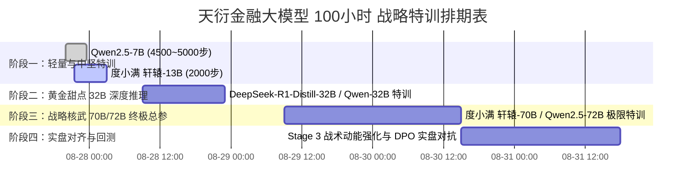

# 🎖️ 天衍五维量化 · 100小时算力池多梯队金融大模型战略特训路线图 (TODO List)

> **计算节点**：AMD Instinct ROCm 旗舰加速卡（**192 GB 物理显存**，200 GB RAM，23 物理核心）  
> **总可用配额**：100.0 小时  
> **更新时间**：2026-08-27 22:30:00

---

## 🧭 总体战略规划与作战序列 (Master Milestones)

---

## 📋 详细任务清单 (TODO Checklist)

### 📌 阶段一：轻量突击手与金融中坚（进行中 · 预计消耗 6~8 小时）
- [x] **Step 1.1**：A10 成果无缝交接，在 Step 4100 自动落盘并保存 `checkpoint-4100`。
- [x] **Step 1.2**：迁移至 AMD 192GB 平台，升级 8-CPU workers + 锁页内存 + 16 批次高吞吐。
- [x] **Step 1.3**：双轨并行拉起度小满 **XuanYuan-13B**（从 `checkpoint-1150` 续训）。
- [ ] **Step 1.4【今晚达成】**：
  - **Qwen2.5-7B** 冲刺 **Step 4500 ~ 5000**（消化 8 万条微积分题解），生成 `checkpoint-5000` 并双保险同步云盘。
  - **度小满 13B** 冲刺 **Step 2000**（消化 3.2 万条样本），生成 `checkpoint-2000` 并双保险同步云盘。
- [ ] **Step 1.5**：执行滚动清理，保留关键里程碑（`4100` / `5000` / `1150` / `2000`），释放中间临时缓存。

---

### 📌 阶段二：黄金甜点 32B 深度因果推理（明日启动 · 预计消耗 12~15 小时）
> **定位**：兼具 70B 级推理因果脑力与 13B 级高频响应速度，192GB 显存单卡黄金适配模型。

- [ ] **Step 2.1**：从 ModelScope 下载 `DeepSeek-R1-Distill-Qwen-32B` 或 `Qwen/Qwen2.5-32B-Instruct` 基础权重至 `/mnt/workspace/models/`。
- [ ] **Step 2.2**：构建 32B 专属训练脚本 `gpu_rocm_32b_lora_train.py`（优化 Batch Size = 8，Gradient Accumulation = 2，显存预估 65GB）。
- [ ] **Step 2.3**：加载 25.5 万条五维时空微积分 + 高阶衍生张量（CPR, ηV, BRI, SMPI, CYF66/VMA55）完整数据集。
- [ ] **Step 2.4**：连续特训 12~15 小时至收敛，产出 `omni-tactical-32b-lora` 核心成果。

---

### 📌 阶段三：战略核武 700 亿超大脑容量（后天启动 · 预计消耗 25~30 小时）
> **定位**：战役级超级金融参谋长，千亿预训练语料底座，擅长跨周期宏观、全市场博弈与深度财报勾稽穿透。

- [ ] **Step 3.1**：选定并下载 **度小满 `XuanYuan-70B-Chat`** 或 **通义千问 `Qwen2.5-72B-Instruct`**。
- [ ] **Step 3.2**：配置 4-bit / 8-bit QLoRA 或 bfloat16 LoRA 高性能训练管线（显存预估 110~115GB / 192GB，留足 80GB 激活余量）。
- [ ] **Step 3.3**：挂载 25.5 万全量数据集，以 80~90 秒/步进行连续 25~30 小时深度熔炼。
- [ ] **Step 3.4**：产出 700 亿金融大模型专属权重 `omni-tactical-70b-finllm`，并执行全维度基准测试。

---

### 📌 阶段四：实战对齐与全市场对抗演练（结余时间 · 预计消耗 20~25 小时）
- [ ] **Step 4.1**：提取极端实战样本（黄金坑点火 vs 假突破对倒出货 vs 物理真空跃迁），构建 DPO 偏好对齐数据集。
- [ ] **Step 4.2**：对已完成训练的各级模型进行 Stage 3 军令一票否决权与战术对齐微调。
- [ ] **Step 4.3**：在 `app.py` 中接入本地多模型仲裁阵列（7B 负责快速初筛、32B 负责盘中波段推演、70B 负责战略复盘）。

---

## 📊 100 小时算力配额消耗预算表

| 任务序列 | 预计耗时 (小时) | 累计消耗 (小时) | 剩余配额 (小时) | 产出核心成果 |
| :--- | :--- | :--- | :--- | :--- |
| **阶段一（7B + 13B 双轨并进）** | 6.0 h | 6.0 h | **94.0 h** | `Qwen-7B (4500+步)` + `XuanYuan-13B (2000步)` |
| **阶段二（32B 深度推理黄金模型）** | 14.0 h | 20.0 h | **80.0 h** | `Omni-Tactical-32B-LoRA` (深层因果链) |
| **阶段三（70B/72B 重型金融核武）** | 28.0 h | 48.0 h | **52.0 h** | `Omni-Tactical-70B-FinLLM` (超级脑容量) |
| **阶段四（DPO 实战博弈强化与回测）**| 20.0 h | 68.0 h | **32.0 h** | 极端行情一票否决与全市场回测基准 |
| **战略机动与安全预留缓冲池** | 32.0 h | 100.0 h | **0.0 h** | 突发重训、断点调试、参数调优备用 |

---
> 参谋部已将本规划永久归档并实时跟踪，请统帅随时下达作战阶段转换指令！
